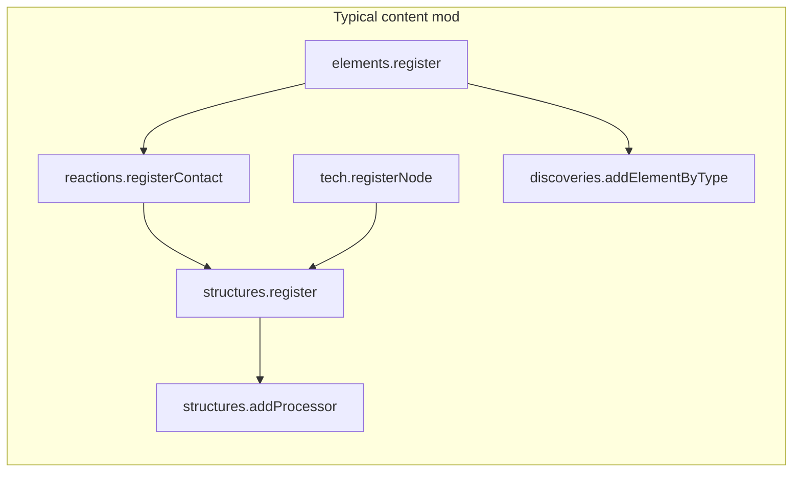

# Mod ideas

Ideas for Sandustry mods that extend game content. Use this page when you plan a new mod or look for a Workshop concept.

Sandustry is a **falling-sand factory game**. You excavate terrain, move powders and liquids with conveyors and pipes, refine materials, automate with signals and energy, and unlock tech. Mods run as bundled TypeScript through [`sandkit.api`](api/sandkit/README.md).

## Reference mods in this repo

| Mod                                                       | What it shows                                          |
| --------------------------------------------------------- | ------------------------------------------------------ |
| [`content-machine`](../examples/content/content-machine/) | Full loop: two elements, one structure, `addProcessor` |
| [`custom-element`](../examples/content/custom-element/)   | One powder element and a paint binding                 |
| [`overlay-hotkey`](../examples/ui/overlay-hotkey/)        | React overlay and hotkey                               |
| [`settings`](../examples/api/settings/)                   | `configSchema` settings                                |
| [`retro-game`](../examples/games/retro-game/)             | Retro Console mini-game                                |

Vanilla already has sand, water, lava, fire, steam, gold, petalium, seeds, growers, pipes, pumps, filters, drones, guns, energy, signals, and a large tech tree. See [`ElementType`](api/sandkit/enums/enumerations/ElementType.md), [`StructureType`](api/sandkit/enums/enumerations/StructureType.md), and [`Tech`](api/sandkit/enums/enumerations/Tech.md).

Good content mods add a **missing loop** or deepen an under-used system. Do not copy vanilla machines with new colours only.

## Tier 1 — Strong content extensions

These follow the [`content-machine`](../examples/content/content-machine/main.ts) pattern. They fit the Steam Workshop well.

### Chemistry pack

Add three to five elements (acid, alkali, salt crust, neutral slurry, crystal). Chain them with [`reactions.registerContact`](api/sandkit/api/namespaces/reactions/README.md). Example: water plus acid gives diluted acid; acid plus basalt gives gas and residue. A **reactor tray** structure converts one cell per tick.

Vanilla has fire, steam, lava, and ice, but little deliberate chemistry. Contact reactions are first-class API.

**API:** `elements`, `reactions`, `structures.addProcessor`, `discoveries`, `tech.registerNode`, optional `terrains.register` for ore veins.

**Scope:** Medium. Ship a Chemistry tech branch with two structures (mixer, neutralizer).

### Alternate smelting — alloys and dross

Add powders that process only in a custom **Alloy Furnace**. Example recipe: gold plus gloom plus flux gives dark alloy; wrong ratios give **dross** waste. Use [`structures.recipes.register('smelter', ...)`](api/sandkit/api/namespaces/structures/namespaces/recipes/README.md) or a dedicated processor with weighted outputs.

This extends the gold and petalium economy without replacing vanilla smelters.

**API:** `elements`, `structures`, `addProcessor` or weighted refinery recipe, `upgrades.register` for furnace speed.

### Biology and agriculture

Add a seed → sprout → crop → **biomass** → **biofuel** chain. Register grower recipes with [`processing.registerGrower`](api/sandkit/api/namespaces/processing/README.md) or planter box recipes. Biomass feeds a **Composter**; biofuel fills [`energy.registerType`](api/sandkit/api/namespaces/energy/README.md) storage.

Vanilla has seeds, petalium, and growers. Room remains for more crops and fuel loops.

**API:** `elements` (Slushy, Liquid, Powder), `processing`, `structures`, `energy`, `tech`.

### Logistics — sorters, buffers, bulk storage

Add signal-aware logistics:

- **Smart splitter** — route by element type through a processor scan
- **Buffer chest** — hold N cells, release on signal
- **Bulk hopper** — energy-backed storage

Wire them with [`signals.targets.register`](api/sandkit/api/namespaces/signals/namespaces/targets/README.md).

Late-game factories need density and control. Vanilla has filters and splitters; signal-aware logistics are popular in factory games.

**API:** `structures`, `structureBehaviors.registerConveyorType`, `signals`, `energy`, `addProcessor`.

**Scope:** Medium to large. Start with one smart splitter before a full pack.

### Fluid engineering

Add liquids (oil, coolant, gel) with different density and viscosity (`MatterType.Liquid` or `Slushy`). Add a **phase separator** (one liquid in, two layers out) and a **heat exchanger** (steam contact heats oil). Vanilla pipes and pumps stay; the mod adds elements and recipes that reward fluid plants.

**API:** `elements`, `reactions`, `structures.addProcessor`, optional `lights` VFX for heated fluids.

## Tier 2 — Progression and discovery

### Modded tech tree branch

Add a parallel tech chain unlocked after a vanilla milestone (for example Kinetic Press). Each node unlocks one structure or element. Use [`tech.registerNode`](api/sandkit/api/namespaces/tech/README.md) with `parentId` on vanilla or mod nodes.

Good nodes: alloy furnace, signal clock, drone pad upgrade, excavation laser profile.

**API:** `tech`, `player.buildings.unlockByType`, `i18n`, `ui.toast` on unlock.

### Discovery journal quests

Add custom progression steps: produce 100 units of mod element X, or build four signal-linked structures. Track with [`triggers.register`](api/sandkit/api/namespaces/triggers/README.md) and cell scans. Complete with [`progression.complete`](api/sandkit/api/namespaces/progression/README.md). Reward: tech unlock or upgrade level.

This gives purpose to new content without patching vanilla quests.

### Excavation tier and terrain ores

Register [`terrains.register`](api/sandkit/api/namespaces/terrains/README.md) ore tiles and [`excavation.registerProfile`](api/sandkit/api/namespaces/excavation/README.md) for a late-game drill. Mining yields mod powders that feed Tier 1 loops.

This connects world generation to factory content.

## Tier 3 — Gameplay modes

### Hardcore and limited lives

Extend hook-based gameplay: finite respawns, stronger hazard zones, food or health from petalium or mod crops. Use [`hooks`](api/sandkit/api/namespaces/hooks/README.md) for input and movement. Use `sandkit.react` for HUD.

### Scenario and challenge maps

Set starting inventory, unlock specific buildings, and win when a production quota is met. Use the [`game:ready`](../examples/content/content-machine/main.ts) event, `progression.complete`, and optional [`maps`](api/sandkit/api/namespaces/maps/README.md) hooks.

Examples:

- **Bootstrapped factory** — only conveyors and one ore
- **Oil spill cleanup** — contain a liquid spread

### Light combat and defense

Register [`projectiles`](api/sandkit/api/namespaces/projectiles/README.md) and [`items`](api/sandkit/api/namespaces/items/README.md) for a turret that consumes gold flakes. Use [`triggers`](api/sandkit/api/namespaces/triggers/README.md) to spawn gloom from map edges. Keep scope small. Sandustry is not a tower-defense game, but light pressure can work with a health/hazard mod installed.

## Tier 4 — Polish and meta

These extend the game without new factory loops:

- **Blueprint library** — save and load structure selections (overlay + input bindings, see [`overlay-hotkey`](../examples/ui/overlay-hotkey/) and [`input-binding`](../examples/ui/input-binding/))
- **Production dashboard** — overlay that counts elements on a filter line ([`ui.overlays.register`](api/sandkit/api/namespaces/ui/namespaces/overlays/README.md))
- **Retro Console games** — more [`registerRetroGame`](../examples/games/retro-game/) titles tied to in-world unlocks
- **Sound and music boxes** — expand vanilla SoundBox with mod samples through [`sound`](api/sandkit/api/namespaces/sound/README.md)

## Recommended first build

**Best starter:** Chemistry pack, or a content-machine clone with one twist.

Reasons:

- Copy [`content-machine`](../examples/content/content-machine/) directly.
- Add one or two [`registerContact`](api/sandkit/api/namespaces/reactions/README.md) reactions before the processor. This teaches the full Sandkit content stack.
- Ship a small Workshop mod with clear player steps (like the content-machine README).

**Skeleton:**

1. `modinfo.ts` — modinfo and config schema (`enabled` toggle)
2. `main.ts` — register elements, reactions, structure, processor, i18n, discoveries, tech node; unlock on `game:ready`
3. `mod/converter.png` — structure sprite through `sprites.loadFromMod`
4. Optional `worker.ts` only when simulation must run off the main thread ([worker API](api/worker/README.md))

See [Quick start](quick-start.md) and [Folder layout](layout.md) to scaffold the folder.

## What to avoid

- **Pure reskins** — players want new behaviour (density, reactions, recipes), not recoloured sand
- **Too many structures in v1** — one tight loop beats a content dump
- **Cross-mod imports** — each mod is isolated; shared helpers live in `modkit/` (see [layout](layout.md))
- **Patches first** — prefer Sandkit API; use [patches](patches.md) only when the API cannot do the job

## High-impact picks

If you want to build next, these four have the best payoff:

1. **Chemistry pack** — new elements, contact reactions, one reactor structure
2. **Logistics pack** — signal-aware splitter
3. **Agriculture and biofuel** — grower recipes and energy storage loop
4. **Scenario mod** — quota win condition; fast to prototype, good for streaming

Any of the above can start from copying [`content-machine`](../examples/content/content-machine/) to `src/<your-mod>/`.
