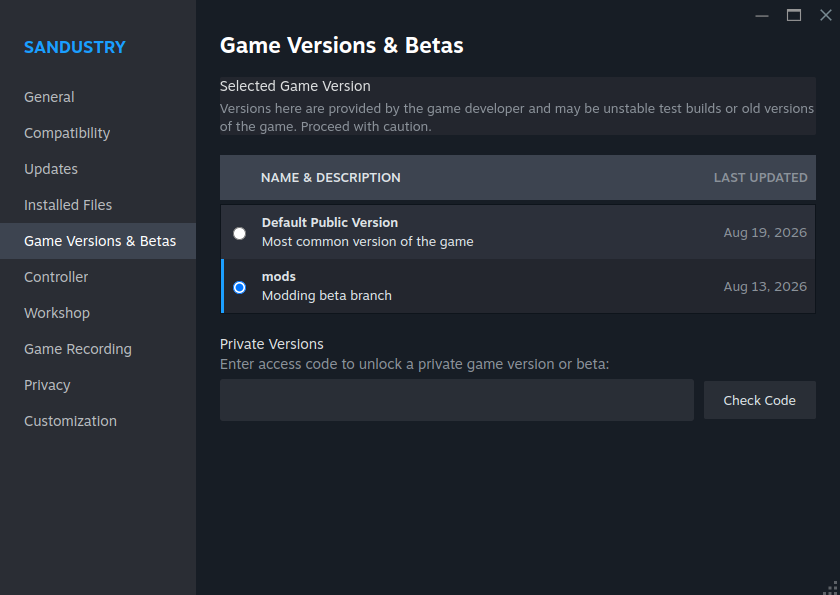

# Troubleshooting

**`npm run setup` fails** — Fix each `FAIL` line, then run `npm run setup` again. Common checks: Node 24, root `npm install`, `modkit/types/`, Sandustry binary / `SANDUSTRY`, Steam **[mods]** beta, and `sandkit` in the game asar.

**Mods do not load** — Opt into the Steam beta: Library → Sandustry → Properties → Betas → select `mods`. Run `npm run setup` to confirm the asar has `sandkit`.



**Game binary not found** — Point the launcher at your executable.

Linux:

```bash
export SANDUSTRY=/path/to/steamapps/common/Sandustry/sandustry
```

Default probe includes `~/games/SteamLibrary/steamapps/common/Sandustry/sandustry` and Steam library folders from `libraryfolders.vdf`.

Windows (PowerShell):

```powershell
$env:SANDUSTRY="C:\Program Files (x86)\Steam\steamapps\common\Sandustry\Sandustry.exe"
```

Windows (cmd):

```bat
set SANDUSTRY=C:\Program Files (x86)\Steam\steamapps\common\Sandustry\Sandustry.exe
```

Default probe includes `%ProgramFiles(x86)%\Steam` and `%ProgramFiles%\Steam`, plus libraries from `libraryfolders.vdf`.

**Mods / logs folders**

| OS      | Mods                                                        | Logs                       |
| ------- | ----------------------------------------------------------- | -------------------------- |
| Linux   | `~/.config/sandustry/mods/<modinfo.id>`                     | `~/.config/sandustry/logs` |
| Windows | `%APPDATA%\sandustry\mods\<modinfo.id>` (`AppData\Roaming`) | `%APPDATA%\sandustry\logs` |

`dist/` links to the OS sandustry mods folder (symlink on Linux, directory junction on Windows). `logs/` links to the OS sandustry logs folder.

**Duplicate mods in the console** — After a rename, old folders can stay in the OS mods directory. The game loads every folder there, so you get two copies of each sample. The watch build removes leftover game folders this template used to own. Stopping `npm run dev` also removes those owned folders. Restart the game after a rename or after you stop the watch.

**VS Code breakpoints do not bind** — Run `npm run dev`, then select **Sandustry** and press F5. That launches the game, waits for CDP `:9222`, then attaches **Renderer** (mods). Set breakpoints in `src/<name>/` TypeScript files, not in `dist/` or `main.js`. Do not press **F12** while the IDE debugger is attached — Electron DevTools steals the CDP session. Keep **Open DevTools on load** off under F5. Launch configs must allow `sandkit-workshop://**` in `resolveSourceMapLocations` (the game names mod scripts that way).

**F5 attach fails or the game will not stop** — Press F5 again (preLaunch runs stop first), or run the **sandustry:stop** task / `node scripts/sandustry/sandustry-stop.js`. That kills the recorded session PID and frees `:9222` if it still listens.

**Debugger Restart says "No debugger available"** — Select **Sandustry** (the Node launch), not a renderer-only attach. Restart must kill and relaunch the game process; Chrome attach Restart is a page reload and cannot run after that process is gone.

**Code changes do not show in game** — Keep `npm run dev` running so the watch rebuilds `main.js`. Then **restart the game**. A DevTools page reload does not restart workers or re-apply `patches.json`. Overlay / Tailwind saves must log `built` in the watch terminal.

**`npm run publish` hangs after a successful upload** — SteamCMD used to keep the `Steam>` prompt because it inherited the terminal. Publish now closes stdin and stops SteamCMD if it does not exit. See [Workshop publish](builds.md#workshop-publish).

**`npm run publish` fails to download SteamCMD** — Publish fetches the official Valve installer into `~/.cache/sandustry-steamcmd/` when that install is missing. Check the network, or unpack SteamCMD yourself from the [SteamCMD](https://developer.valvesoftware.com/wiki/SteamCMD) page into that folder. See [Workshop publish](builds.md#workshop-publish).

**`npm run publish` fails with "No cached credentials"** — SteamCMD login is separate from the Steam client (credentials live under `~/.cache/sandustry-steamcmd/`). On a TTY, publish prompts for password / Steam Guard once, then uploads. Without a TTY, run `~/.cache/sandustry-steamcmd/steamcmd.sh +login <account>` once (use the item owner), then publish again. Full SteamCMD output is in `.tmp/steamcmd-publish.log`.

**Types missing** — Pull the latest template. Sandkit API declarations live in `modkit/types/`. See [modkit/types/README.md](../modkit/types/README.md).
