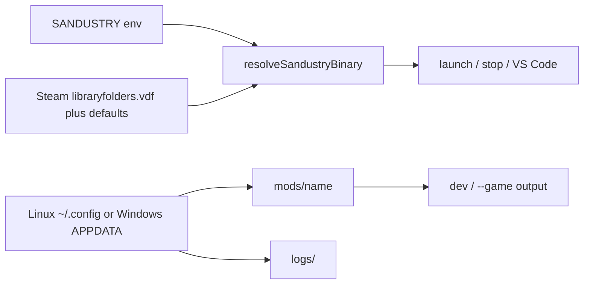

# Windows and Linux support

## Goal

Run the template on Windows and Linux: resolve Electron user-data and Steam install paths per OS, replace Linux-only process and display tools, and document both platforms.

## Why

npm scripts already call `node scripts/...`, so commands work on Windows. The blockers are hard-coded Linux paths (`~/.config/sandustry`, `~/games/SteamLibrary/.../sandustry`) and Unix tools (`pgrep`, `pkill`, `xrandr`, `wmctrl`, `sleep`).

Official log paths:

- Linux: `~/.config/sandustry/logs/main.log`
- Windows: `%APPDATA%\sandustry\logs\main.log` (`AppData\Roaming\sandustry`)

The Windows game binary is `Sandustry.exe` under `steamapps/common/Sandustry`.

Mac is out of scope.

## Acceptance

- [ ] `npm run dev` / `--game` writes to `%APPDATA%\sandustry\mods\<modinfo.name>` on Windows and `~/.config/sandustry/mods/<modinfo.name>` on Linux
- [ ] `npm run sandustry` finds `Sandustry.exe` (or `sandustry` on Linux) from `SANDUSTRY`, default Steam roots, or `libraryfolders.vdf`; missing binary prints a platform-specific set example
- [ ] Stop works without `pgrep` / `pkill` / Unix `sleep` (Windows `tasklist` / `taskkill /IM <exe> /T`)
- [ ] Launch does not require `xrandr` / `wmctrl` on Windows; `--start-maximized` still applies
- [ ] `dist/` and `logs/` links work on Windows without Developer Mode (directory junctions)
- [ ] F5 uses `${workspaceFolder}` cwd and `${userHome}` in source-map overrides
- [ ] Release debug stub and preview static server compare paths with mixed `\` / `/`
- [ ] README, layout, builds, AGENTS, troubleshooting, and script comments list both OS paths
- [ ] `.gitattributes` keeps JS/markdown as LF on Windows clones

## Spec

### Path helpers

Add [`scripts/sandustry/paths.js`](../scripts/sandustry/paths.js) so [`mod-path.js`](../scripts/sandustry/mod-path.js) does not import launch code.

- `sandustryUserDataDir()`: Linux `~/.config/sandustry`; Windows `%APPDATA%/sandustry`
- `sandustryModsDir()` / `sandustryLogsDir()` from that root
- `resolveSandustryBinary()`:
  1. Use `process.env.SANDUSTRY` when set
  2. Probe default Steam roots (keep `~/games/SteamLibrary/.../sandustry` on Linux; add `%ProgramFiles(x86)%\Steam` and `%ProgramFiles%\Steam` on Windows)
  3. Parse `steamapps/libraryfolders.vdf` and `config/libraryfolders.vdf` for extra libraries
  4. Look for `sandustry` (Linux) or `Sandustry.exe` / `sandustry.exe` (Windows)

[`mod-path.js`](../scripts/sandustry/mod-path.js): `MOD_DIR = join(sandustryModsDir(), MOD_FOLDER_NAME)`.

### Junctions

On Windows, `linkRepoDistToModOutput` and the logs link in [`references.js`](../scripts/sandustry/references.js) must use a directory junction (`symlinkSync(target, path, "junction")`). A normal symlink needs Developer Mode or admin. Compare targets with resolved, case-insensitive paths on Windows.

### Launch and stop

Update [`scripts/sandustry/sandustry-common.js`](../scripts/sandustry/sandustry-common.js):

- **Stop / is-running:** Linux keeps `pgrep` / `pkill` on the resolved binary path. Windows uses `tasklist` / `taskkill /IM <exe> /T` (try without `/F`, then with `/F`).
- **Wait loop:** replace `execSync("sleep 0.25")` with a sync wait (`Atomics.wait`) so stop works on cmd/PowerShell.
- **Monitors:** Linux keeps `xrandr`. Windows: try a short PowerShell `System.Windows.Forms.Screen` query; on failure use `{ x: 0, y: 0 }` instead of exit.
- **Maximize:** Linux keeps `wmctrl`. Windows is a no-op (`--start-maximized` is already in launch args).
- **Spawn:** keep `spawn(SANDUSTRY, args)` with no shell so `Program Files` spaces stay safe. Keep `--no-sandbox` (needed on Linux; ignored on Windows).

`sandustryRequireBinary` must print the Windows `set` / PowerShell example when the binary is missing.

### VS Code

[`.vscode/launch.json`](../.vscode/launch.json):

- Set `cwd` to `${workspaceFolder}` (the wrapper already starts the game in `SANDUSTRY_DIR`).
- Replace `${env:HOME}` with `${userHome}` in source-map overrides so F5 works when `HOME` is unset.

Tasks already call `node`; no bash.

### Other Windows path bugs

In [`scripts/build/esbuild.config.mjs`](../scripts/build/esbuild.config.mjs), the release stub matches `join("src", "main.ts")`. On Windows that is `src\main.ts` and can miss `src/main.ts`. Match `/[\\/]src[\\/]main\.ts$/` instead.

Same class of check in [`scripts/ui/generate-previews.mjs`](../scripts/ui/generate-previews.mjs) (`filePath.startsWith(ROOT)`): compare resolved paths so mixed slashes do not 404.

### Docs

Update path wording in [`README.md`](../README.md), [`docs/README.md`](../docs/README.md), [`docs/layout.md`](../docs/layout.md), [`docs/builds.md`](../docs/builds.md), [`AGENTS.md`](../AGENTS.md), and script comments.

Expand [`docs/troubleshooting.md`](../docs/troubleshooting.md):

- Linux: `export SANDUSTRY=/path/to/sandustry`
- Windows: `$env:SANDUSTRY="C:\...\Sandustry.exe"`
- Default mods folders for both OS
- Note that `dist/` and `logs/` are junctions on Windows

Add [`.gitattributes`](../.gitattributes) with `* text=auto eol=lf` so clones on Windows do not convert JS to CRLF.

## Verify on Windows

These checks cannot run in the Linux workspace:

- `npm install` / `npm run build` / `npm run dev` write to `%APPDATA%\sandustry\mods\<name>`
- `npm run sandustry` finds `Sandustry.exe` or fails with a clear `SANDUSTRY` message
- Stop and F5 attach still work
- `npm run references` links `%APPDATA%\sandustry\logs`

## Origin

Launch, stop, mods output, references, and VS Code debug configs assume a Linux Steam install and X11 tools.
